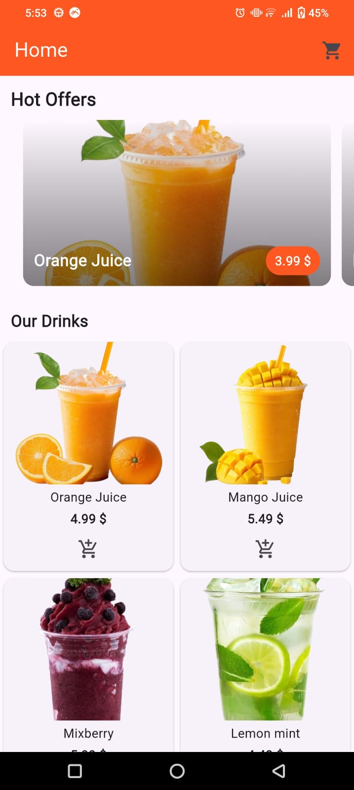
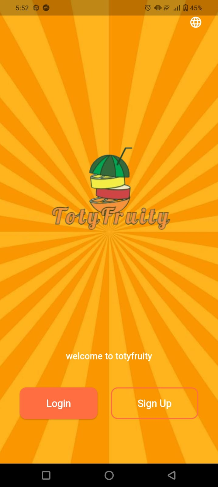
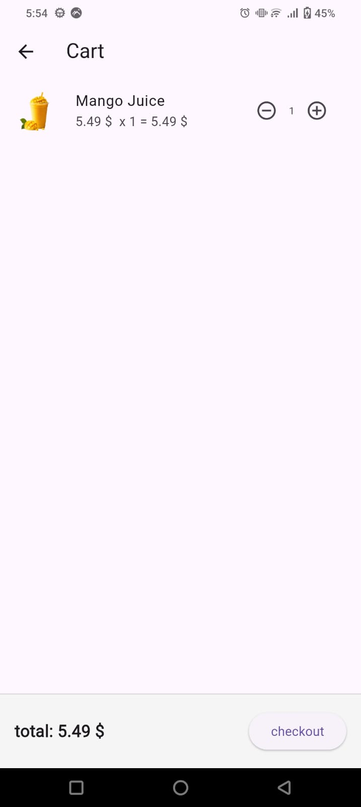

TotyFruity

 Project Overview
TotyFruity is a system designed for managing and showcasing **fresh juices**.  
It allows users to explore different juice options, and manage orders in a clean and simple interface.  

---

 Features
-  Display a variety of fresh juices with images.
-  Add juices to cart / place orders.
-  Smooth and user-friendly interface.
---
screenshots
homepage

welcomepage

cart

---

 Setup Instructions
1. Clone the repository:
   ```bash
   git clone https://github.com/AliaaMamdouh6/TotyFruity.git
